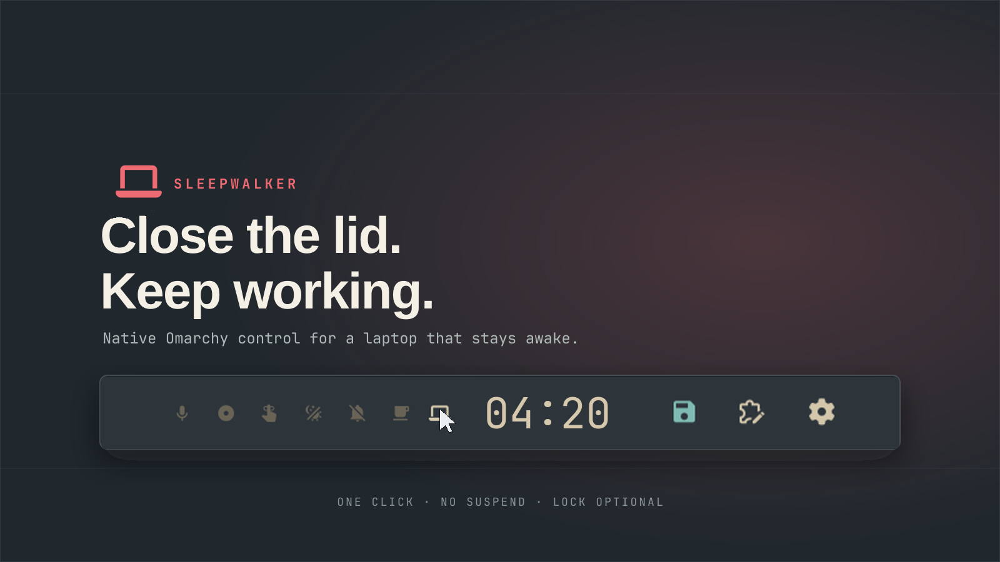
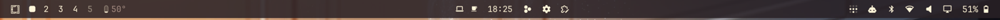
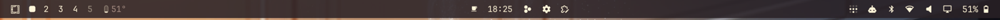

# Omarchy Sleepwalker

Close your laptop and keep working. One click, no suspend, lock optional.



## What it does

Laptops suspend when you close the lid. Sleepwalker adds a **Laptop indicator** to Omarchy's bar: click it and closing the lid only powers off the panel — downloads, builds, servers and SSH sessions keep running. Click again and you're back to stock.

| Lid closed, Sleepwalker… | Result |
|---|---|
| **ON** | Panel off. No suspend, no hibernate, no lock. Keeps working. |
| **OFF** (stock) | Suspend-then-hibernate (+ lock unless docked). |
| **ON + lock** (`lock on`) | Panel off + locked. Still no suspend. |

## Looks stock, because it is the strip

No separate widget, no oversized icon. Sleepwalker **is** Omarchy's indicator strip with a 7th entry — same size, same dim-when-off, same hover-reveal as the other six:

**ON** — bright, next to the clock:



**OFF** — dimmed among the rest (inactive indicators hide until hover, like stock):



## Install

```sh
omarchy plugin add https://github.com/tymurbogach/omarchy-sleepwalker.git --enable --yes
./install.sh
```

Always install with `--yes`: the entry inherits the stock strip slot, and
the section question would displace it. The installer integrates, never
moves: it only ensures `Laptop` is in the strip's items, wherever it sits.

| Step | What you get |
|---|---|
| `plugin add` | The indicator strip with Laptop (inherits your indicator list). |
| `install.sh` | Adds Laptop to the strip, puts the CLI on `PATH`, installs the lid-close shim, and pins the lid binding to the shim by absolute path (bare names resolve by `PATH`, and systemd-unit contexts would run stock and lock). Restarts the shell once if the layout changed, never on a no-op re-run. Everything inside `$HOME` — no sudo, no services. |

The inhibitor is held by the plugin's own service while the toggle is on; disabling or removing the plugin releases it.

## Use

Click the  indicator, or from the terminal:

```sh
omarchy-sleepwalker lid on|off|toggle   # keep working with lid closed
omarchy-sleepwalker lock on|off|toggle  # also lock on close (default off)
omarchy-sleepwalker status --json       # {"active":true,"inhibitActive":true,"lockOnLid":false}
omarchy-sleepwalker doctor              # reconcile toggle vs inhibitor
```

`lock` is opt-in and off by default; with `lock on` the lid still never
suspends. Stock idle keeps counting with the lid closed (screensaver at
150 s, lock at 600 s) — that is Omarchy behavior, not controlled here.

Configure like any indicators strip:

```sh
omarchy bar set io.github.tymurbogach.sleepwalker items '["Dictation","Laptop","StayAwake"]' --json
```

After an `omarchy update`, refresh the stock indicator copies (Laptop is untouched):

```sh
./install.sh --sync-stock
```

## Remove

```sh
./uninstall.sh
omarchy plugin remove io.github.tymurbogach.sleepwalker
```

In this order the restored built-in strip comes back clean. Lid close returns to stock suspend.

## How it works

- **Indicator** (`indicators/Laptop.qml`): a native `BarIndicator` bound reactively to the plugin service. No polling. The six sibling files are verbatim copies of Omarchy's stock indicators — don't edit them by hand, refresh with `./install.sh --sync-stock`.
- **Inhibitor** (`Service.qml`): holds `systemd-inhibit --what=handle-lid-switch` exactly while the toggle is on.
- **No lock**: `./install.sh` places a shim earlier on `PATH` (`~/.local/bin/omarchy-system-lid-close`) that only reconciles displays instead of locking, and pins the lid binding to it by absolute path (systemd-unit contexts resolve stock first by `PATH`). Without either, stock lock applies.
- **State**: `~/.local/state/omarchy/toggles/sleepwalker` (on = file exists) and `lid-lock` (opt-in). CLI, service and indicator read the same files.
- **Privileges**: user session only. No sudo, no setuid, no second shell process, nothing outside `$HOME`.

## License

MIT
